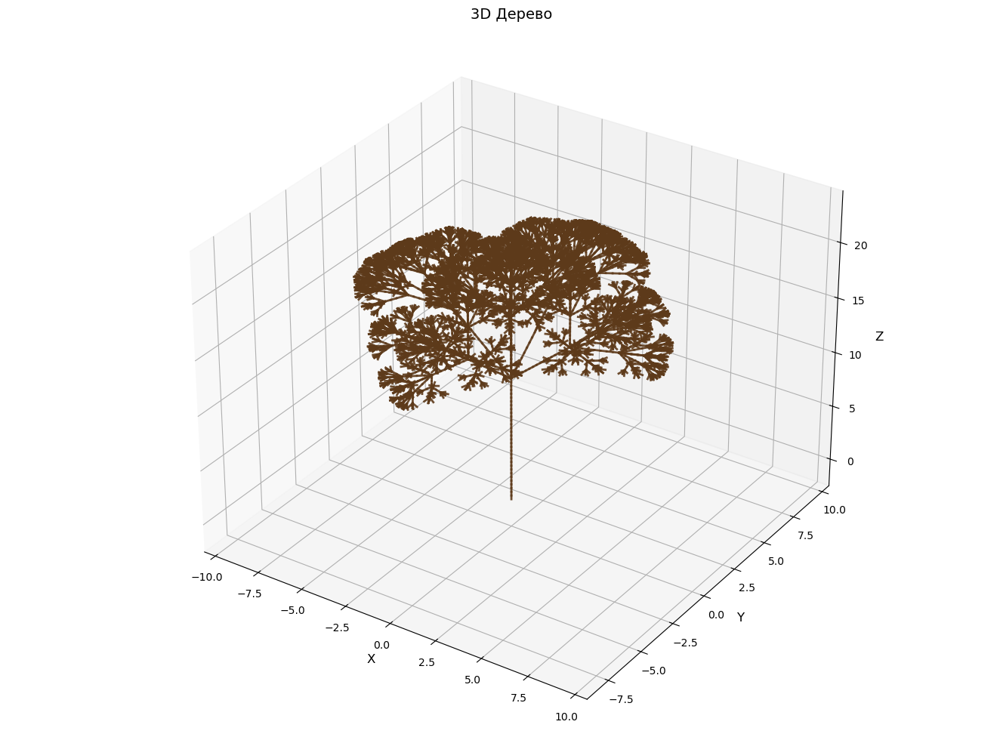

# 3D L-System Tree

Генерация трёхмерного дерева с использованием L-системы
и turtle-графики.

## О проекте

Проект реализует генерацию фрактального дерева в трёхмерном
пространстве с помощью L-системы.

В качестве начального состояния используется аксиома `X`,
а структура дерева формируется последовательным применением
правил переписывания.

## Используемые технологии

- Python
- Matplotlib
- NumPy
- Math

## Как это работает

Используется L-система с правилами:

- `X → F[+X][-X][&X][^X][/X][\\X]`
- `F → FF`

После нескольких итераций полученная строка интерпретируется
черепашкой в трёхмерном пространстве.

Поддерживаются:
- повороты по трём направлениям;
- создание и восстановление состояния ветвления;
- построение отрезков в 3D-пространстве.

## Результат



## Запуск

```bash
pip install matplotlib
python L-system.py
